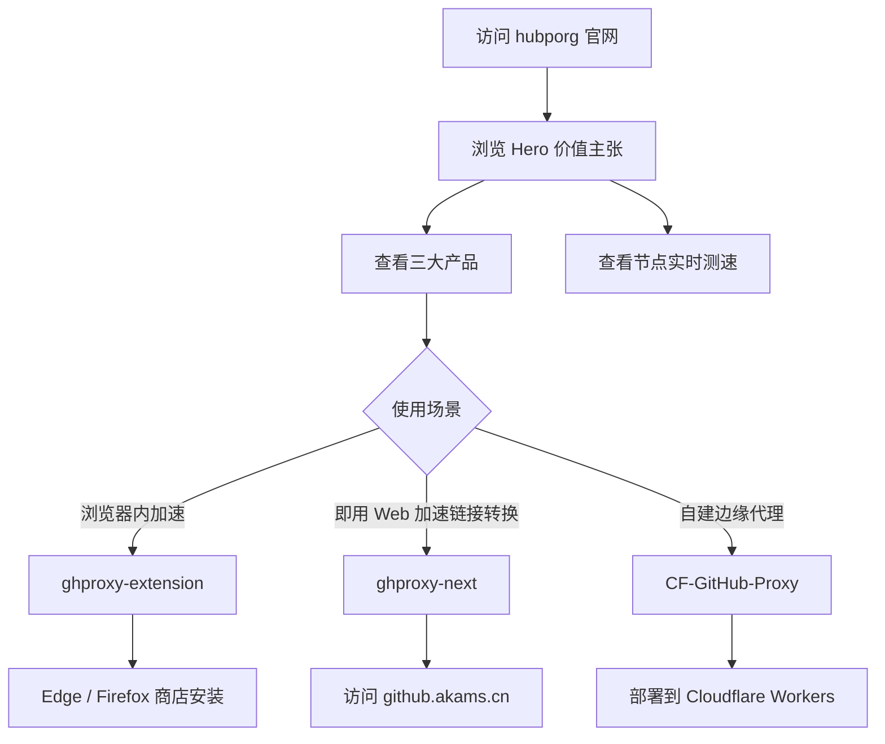

# hubporg 官网 PRD 产品需求文档

## 1. 产品概述

hubporg 官网是一个面向开发者社区的品牌门户，集中展示 **hubporg 组织**旗下的开源项目矩阵。组织核心围绕 **GitHub 与开发者资源加速**展开，提供从**Cloudflare 边缘代理 (CF-GitHub-Proxy)**、**Web 控制台 (ghproxy-next)** 到**浏览器扩展 (ghproxy-extension)** 的完整工具链。官网通过鲜明的技术美学与清晰的产品分层，传达"让开源资源触手可及"的使命。

**Design Read**：技术派品牌站点（参考 github.akams.cn 的 Next.js 深色蓝灰风），桌面优先，DESIGN_VARIANCE: 6, MOTION_INTENSITY: 5, VISUAL_DENSITY: 5。

- **目标用户**：国内/海外开发者、开源贡献者、需要拉取 GitHub/Docker/Hugging Face 资源的研发团队
- **核心价值**：打通 GitHub 加速全链路；展示 hubporg 的技术深度与生态广度；为开发者提供清晰的产品入口

## 2. 产品矩阵（基于 GitHub 仓库真实信息）

| 项目                  | 仓库                      | 类型         | 描述                                                                                                  | 技术栈                                                    | 许可证     |
| --------------------- | ------------------------- | ------------ | ----------------------------------------------------------------------------------------------------- | --------------------------------------------------------- | ---------- |
| **hubp**              | oopsunix/hubp             | 核心代理服务 | 高性能多协议代理服务，支持 GitHub / Docker Registry / Hugging Face 加速，提供 GeoIP、速率限制、热重载 | Rust 98.9% · Dockerfile · Axum · Tokio                    | Apache-2.0 |
| **ghproxy-next**      | hubporg/ghproxy-next      | Web 前端     | 基于 Next.js 重构的 GitHub 代理网站，提供节点选择与测速                                               | Next.js 16 · React 19 · TypeScript 97.9% · Tailwind CSS 4 | GPL-3.0    |
| **ghproxy-extension** | hubporg/ghproxy-extension | 浏览器扩展   | 智能 GitHub 下载加速器，302 重定向模式，兼容 IDM 等下载工具                                           | JavaScript 69.7% · HTML 26.7% · PowerShell                | MIT        |

## 3. 核心功能

### 3.1 页面与模块

1. **首页 Home** - 组织使命、价值观、产品速览、社区入口
2. **项目页 Projects** - 三大产品详细卡片（浏览器扩展 / Web 前端 / 边缘代理）
3. **加速页 Accelerate** - 三种方式加速 GitHub（扩展 / Web 控制台 / Cloudflare 自部署）
4. **节点页 Nodes** - 运行时从 cdn.akams.cn/hubp/github.json 拉取节点列表，拼接 icon128.png 测速
5. **关于页 About** - 组织使命、技术理念、贡献者、社区准则

### 3.2 全局模块

- 顶部导航栏（粘性、毛玻璃）
- 暗色/亮色主题切换
- 实时状态指标条
- 滚动渐入动画

## 4. 核心流程



## 5. 用户界面设计

### 5.1 设计风格（参考 github.akams.cn）

- **主色**：
  - 暗色背景：`#0A0A0F` (近黑) / `#11121A` (面板) / `#0B0B12` (深面板)
  - 文本：`#F4F4F5` (主) / `#8A8F98` (次) / `#6B7280` (灰)
  - 强调色：`#3B82F6` (blue-500) / `#60A5FA` (blue-400) / `#2563EB` (blue-600)
  - 强调色2（绿色，致敬加速）：`#22C55E`
  - 边框：`border-gray-200` / `dark:border-gray-800`
- **按钮**：圆角 6px / 8px，主按钮 `bg-blue-500 hover:bg-blue-600` (亮色) / 暗色模式保持
- **字体**：
  - 标题：`Geist` / `Sora` (sans-serif 现代)
  - 等宽：`JetBrains Mono` (命令行)
  - 中文：`Noto Sans SC`
- **布局**：12 栅格，居中 `max-w-7xl mx-auto px-4 sm:px-6 lg:px-8`
- **图标**：lucide-vue-next
- **动效**：CSS transition + Vue Transition；默认 MOTION_INTENSITY 5

### 5.2 页面设计概览

| 页面   | 模块         | UI 元素                                                        |
| ------ | ------------ | -------------------------------------------------------------- |
| 首页   | Hero         | 巨型标题 + 副标题 + CTA + 背景渐变 + Hero Image                |
| 首页   | 三大产品矩阵 | 三列卡片，每张卡片显示项目名 / 描述 / 技术栈标签 / GitHub 链接 |
| 首页   | 终端演示     | 黑底绿字 CLI 命令流（`docker run`、`git clone`）               |
| 首页   | 节点状态     | 仿 `github.akams.cn` 的节点列表（默认/贡献/测绘）              |
| 项目页 | 项目详情卡   | 大图 + 标签 + GitHub 链接 + Releases 徽章                      |
| 加速页 | 协议能力     | GitHub / Docker / Hugging Face 矩阵                            |
| 加速页 | 快速开始     | 代码片段 + 复制按钮 + Docker compose 模板                      |
| 节点页 | 节点列表     | 模拟测速表格，带 ping 数值与状态点                             |
| 关于页 | 故事         | 组织起源时间轴                                                 |

### 5.3 响应式

- Desktop-first (1440px)
- 平板 (≥768px)：两列
- 移动端 (<768px)：单列、Hero 字号缩放

### 5.4 动效细节

- 滚动触发的 fade-up（IntersectionObserver）
- 字符逐位 Typewriter 出现（Hero）
- 节点测速数值滚动动画
- 主题切换过渡

## 6. 设计 Token

```css
:root {
  --bg-0: #ffffff;
  --bg-1: #f9fafb;
  --bg-2: #f3f4f6;
  --text-0: #111827;
  --text-1: #6b7280;
  --accent: #3b82f6;
  --accent-2: #22c55e;
  --border: #e5e7eb;
}

.dark {
  --bg-0: #0a0a0f;
  --bg-1: #11121a;
  --bg-2: #0b0b12;
  --text-0: #f4f4f5;
  --text-1: #8a8f98;
  --accent: #60a5fa;
  --accent-2: #22c55e;
  --border: #1f2937;
}
```
