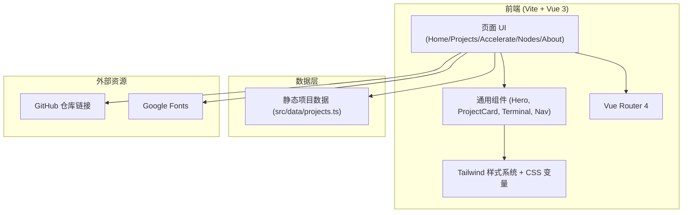

# hubp 官网技术架构文档

## 1. 架构设计



## 2. 技术说明

- **前端**：Vue@3.5 + TypeScript + Vite + TailwindCSS@3
- **路由**：vue-router@4
- **状态管理**：pinia（用于主题切换）
- **图标**：lucide-vue-next
- **字体**：Geist、Sora、JetBrains Mono、Noto Sans SC（Google Fonts CDN）
- **动效**：CSS keyframes + IntersectionObserver
- **后端**：无（纯静态站点）
- **数据源**：内置 `src/data/projects.ts` 静态项目数据

## 3. 路由定义

| 路由 | 用途 |
|------|------|
| `/` | 首页（Hero + 项目矩阵 + 加速演示 + 社区） |
| `/projects` | 项目列表页（卡片网格 + 标签筛选） |
| `/accelerate` | GitHub 加速页（三种方式：扩展 / Web / CF 边缘代理） |
| `/nodes` | 节点页（仿 github.akams.cn 的节点列表） |
| `/about` | 关于 hubporg（组织故事 + 愿景 + 贡献者） |

## 4. 目录结构

```
src/
├── components/         # 通用组件
│   ├── Navbar.vue
│   ├── Footer.vue
│   ├── HeroSection.vue
│   ├── ProjectCard.vue
│   ├── TerminalBlock.vue
│   ├── TagBadge.vue
│   └── NodeList.vue
├── views/
│   ├── HomeView.vue
│   ├── ProjectsView.vue
│   ├── AccelerateView.vue
│   ├── NodesView.vue
│   └── AboutView.vue
├── data/
│   └── projects.ts
├── stores/
│   └── theme.ts
├── composables/
│   └── useReveal.ts
├── styles/
│   └── index.css
├── App.vue
└── main.ts
```

## 5. 关键依赖

```json
{
  "dependencies": {
    "vue": "^3.5.0",
    "vue-router": "^4.4.0",
    "pinia": "^2.2.0",
    "lucide-vue-next": "^0.445.0"
  },
  "devDependencies": {
    "@vitejs/plugin-vue": "^5.1.0",
    "autoprefixer": "^10.4.20",
    "postcss": "^8.4.45",
    "tailwindcss": "^3.4.10",
    "typescript": "^5.5.4",
    "vite": "^5.4.3",
    "vue-tsc": "^2.1.0"
  }
}
```

## 6. 设计 Token

参考 PRD 第 6 节。

## 7. 性能与可访问性

- 路由级代码分割
- 图片懒加载
- 字体 `font-display: swap`
- 颜色对比度 WCAG AA
- 关键交互支持键盘导航
- 支持 `prefers-reduced-motion`
